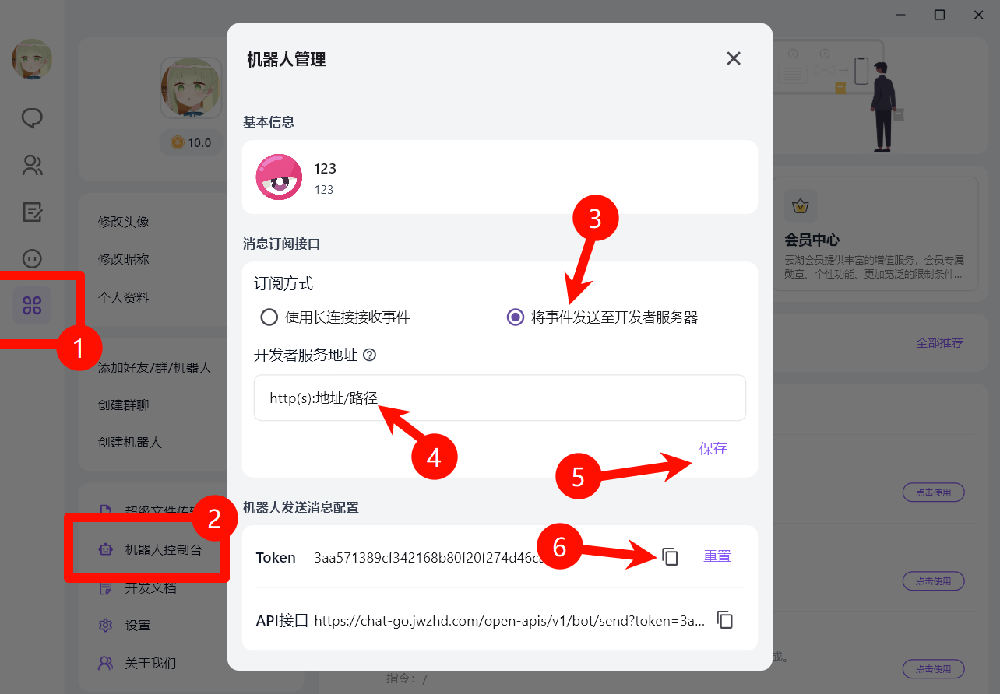

# Webhook 方式接入教程

## 适用场景

本教程适用于选择 **Webhook 方式** 接入的用户。

通过 Webhook 接收事件推送，**需要公网访问能力**。

:::warning
选择此方式前，请务必确认您满足以下**条件之一**：

* 拥有一个公网 IPv4 或 IPv6 地址。
* 使用内网穿透服务（如 frp, Ngrok, Cloudflare Tunnel 等）将您的本地 Koishi 服务暴露到公网。

:::

> **前置准备**：请先完成 [首次接入指南](./start) 中的公共步骤（创建机器人、获取 Token、配置订阅事件）。

## 1. 配置 Webhook 方式

在 Koishi 的插件市场中找到并安装 `adapter-yunhupro` 适配器，然后进入配置页面。

1. **Token**：填入在首次接入指南中获取的机器人 Token
2. **订阅方式**：选择 `webhook`
3. **本机监听路径**：默认为 `/yunhu`，您可以自定义

:::warning
**关于监听路径的重要说明**

如果您需要运行多个云湖机器人实例，请为每个实例配置**不同的监听路径**。

例如：

* 机器人 A：`/yunhu1`
* 机器人 B：`/yunhu2`

使用相同的路径会导致消息混乱！
:::

保存配置，使适配器开始监听本地路径。

## 2. 配置订阅地址

:::warning
注意：此步骤务必使用**公网地址**访问！
:::

1. **确认订阅地址**：将您的 Koishi 公网访问地址与配置的 `path` 组合成完整的 Webhook URL。
    * 例如，如果您的公网域名是 `https://your.domain.com`，并且 `path` 配置为 `/yunhu`，那么完整的订阅地址就是 `https://your.domain.com/yunhu`。
2. **打开浏览器访问订阅地址**：
    * 如果你可以访问看到 `适配器已成功启动` 页面，则说明配置成功！

## 3. 在云湖后台配置 Webhook

回到云湖平台的机器人后台，进行以下配置：

1. **配置订阅地址**：填入您的完整订阅地址，例如 `https://your.domain.com/yunhu`。

2. **订阅事件**：根据您的需求，勾选需要接收的事件类型。

    * 为了确保机器人能正常响应消息，**「消息事件」** 是必须订阅的。

## 4. 测试连接

完成以上所有配置后，您可以对机器人进行一次简单的测试，以验证连接是否成功。

* **私聊** 您的机器人，发送任意消息，例如 `status`。
* 如果您的 Koishi 机器人做出了回应，说明连接已经成功建立。

## 5. Webhook 方式排查

如果机器人没有响应，请检查以下几点：

* Koishi 服务是否正常运行？
* 公网地址和 Webhook 路径是否正确？
* 云湖后台的事件订阅是否已开启？
* 检查 Koishi 的控制台日志，确认是否有来自云湖的请求或任何错误信息。

## 多机器人配置（Webhook）

如果您需要运行多个云湖机器人，请使用 Koishi 的**多开插件功能**：

1. 在插件列表中找到 `adapter-yunhupro`
2. 点击「添加实例」按钮
3. 为每个实例配置不同的 Token

:::tip
**Webhook 方式**：每个实例必须配置不同的监听路径
:::
