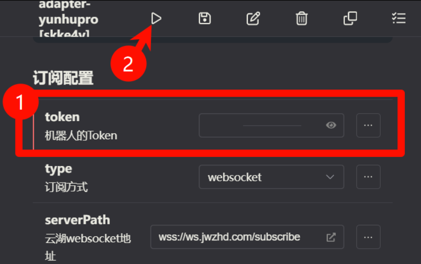

# WebSocket 方式接入教程

## 适用场景

本教程适用于选择 **WebSocket 方式** 接入的用户。

**无需公网 IP**，通过 WebSocket 长连接接收云湖平台的事件推送，配置简单。

> **前置准备**：请先完成 [首次接入指南](./start) 中的公共步骤（创建机器人、获取 Token、配置订阅事件）。

## 1. 配置 WebSocket 方式

在 Koishi 的插件市场中找到并安装 `adapter-yunhupro` 适配器，然后进入配置页面。

1. **Token**：填入在首次接入指南中获取的机器人 Token
2. **订阅方式**：选择 `websocket`（默认，推荐）
3. **云湖 websocket 地址**：默认为 `wss://ws.jwzhd.com/subscribe`，通常无需修改

配置完成后，保存配置即可。

适配器会自动连接到云湖平台并开始接收消息。

## 2. 测试连接

配置完成后进行以下验证：

1. 保存配置，适配器会自动启动
2. 查看 Koishi 控制台日志，确认是否显示 `WebSocket连接已建立`
3. 直接向机器人发送消息测试即可

* **私聊** 您的机器人，发送任意消息，例如 `status`。
* 如果您的 Koishi 机器人做出了回应，说明连接已经成功建立。

## 3. WebSocket 方式排查

如果机器人没有响应，请检查以下几点：

* Koishi 服务是否正常运行？
* 检查 Koishi 的控制台日志，确认 WebSocket 是否成功连接
* Token 是否正确？
* 网络是否能访问 `wss://ws.jwzhd.com/subscribe`？

## 多机器人配置（WebSocket）

如果您需要运行多个云湖机器人，请使用 Koishi 的**多开插件功能**：

1. 在插件列表中找到 `adapter-yunhupro`
2. 点击「添加实例」按钮
3. 为每个实例配置不同的 Token

:::tip
**WebSocket 方式**：每个实例独立连接，无需额外配置
:::
