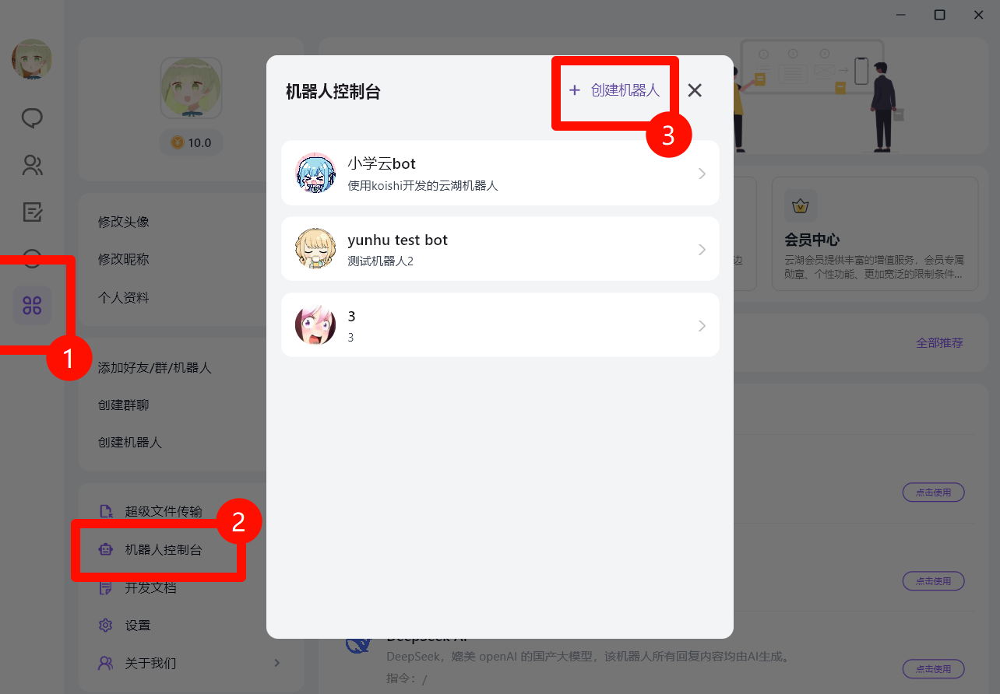
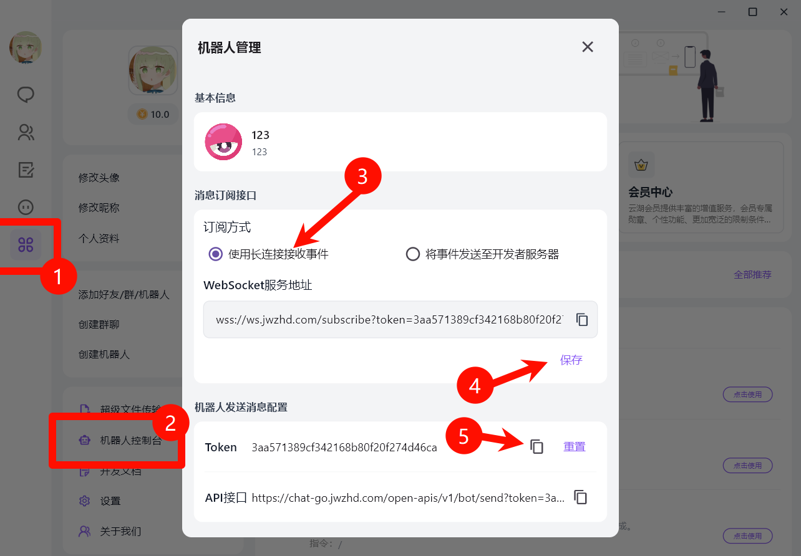
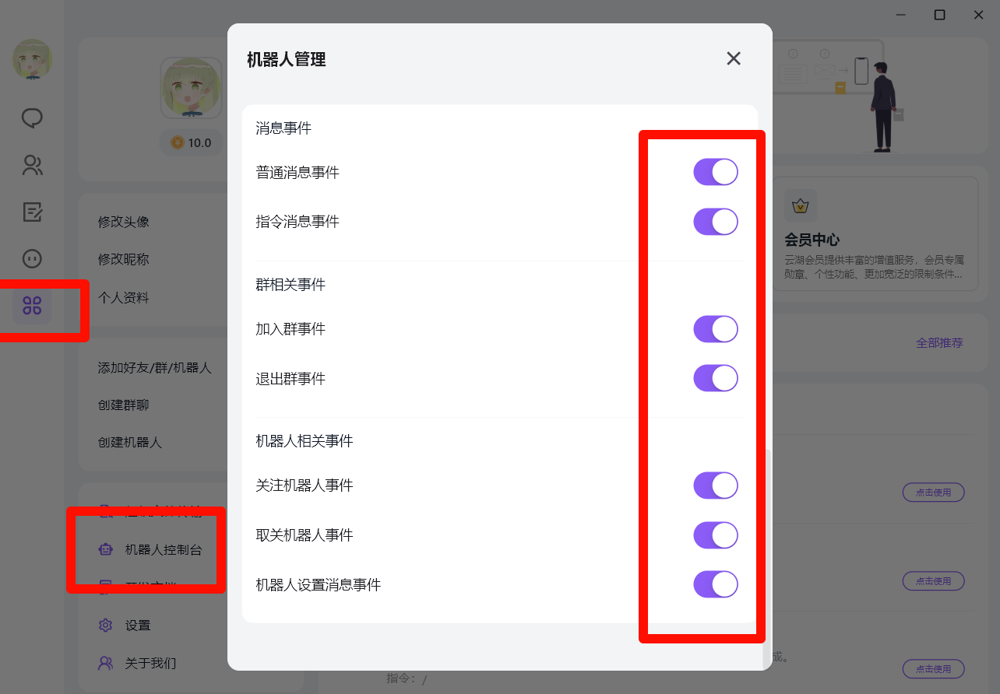
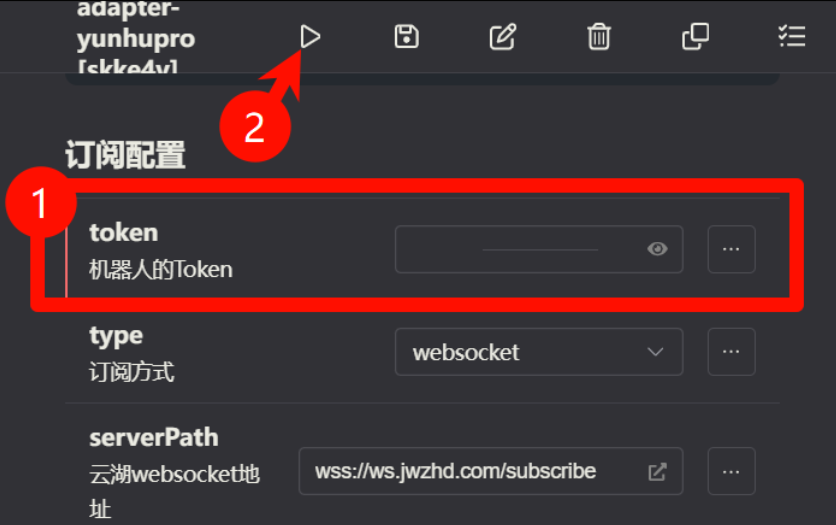
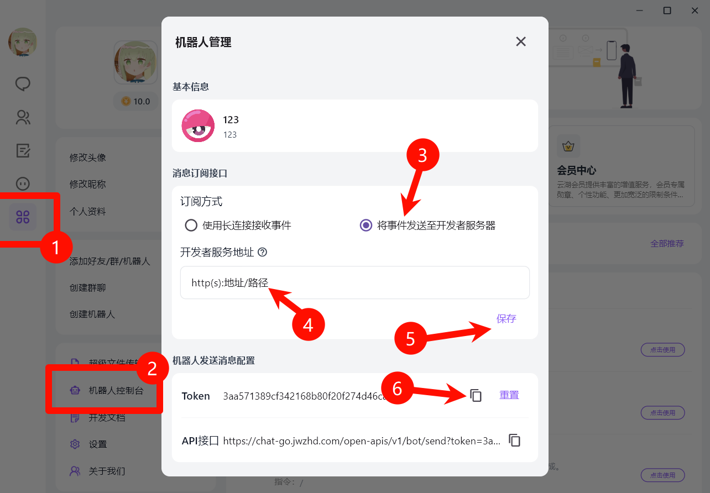

# 首次接入指南

## 首次接入和配置

本指南将引导您完成 `adapter-yunhupro` 在 Koishi 中的首次接入和配置。

## 1. 前置要求

云湖平台支持两种连接方式：

### WebSocket 方式（推荐）

**无需公网 IP**，通过 WebSocket 长连接接收事件推送。

这是默认且推荐的连接方式，配置简单，无需额外的网络配置。

### Webhook 方式

通过 Webhook 接收事件推送，**需要公网访问能力**。

:::tip
如果选择 Webhook 方式，您需要具备**以下条件之一**：

* 拥有一个公网 IPv4 或 IPv6 地址。
* 使用内网穿透服务（如 frp, Ngrok, Cloudflare Tunnel 等）将您的本地 Koishi 服务暴露到公网。

:::

## 连接方式对比

| 特性     | WebSocket | Webhook        |
| -------- | --------- | -------------- |
| 公网 IP  | 不需要    | 需要           |
| 配置难度 | ⭐ 简单    | ⭐⭐⭐ 复杂       |
| 多机器人 | ✅ 无限制  | ⚠️ 需要不同路径 |
| 消息混乱 | ❌ 不会    | ⚠️ 路径相同时会 |
| 推荐程度 | ⭐⭐⭐⭐⭐     | ⭐⭐⭐            |

**推荐使用 WebSocket 方式**，除非您有特殊需求必须使用 Webhook。

## 2. 在云湖平台创建机器人

> **教程以 云湖Windows版客户端 演示**

访问 [云湖官网](https://www.yhchat.com/) ，下载并安装对应的客户端。

注册并登录账号后，进入设置页面，创建一个新的机器人。

根据页面提示，完成机器人的 头像、名称、简介 的配置。

## 3. 获取机器人 Token

打开 **机器人控制台**，复制机器人的 Token：

* **机器人 Token**：这是与云湖 API 通信的密钥。

## 3.1 配置订阅事件

打开 **机器人控制台**，配置机器人接收的事件：

> 可以全部都勾选上

## 4. 配置 Koishi 适配器

在 Koishi 的插件市场中找到并安装 `adapter-yunhupro` 适配器，然后进入配置页面。

### 基础配置

1. **Token**：填入上一步获取的机器人 Token
2. **订阅方式**：选择连接方式
   * `websocket`（默认，推荐）：无需公网 IP
   * `webhook`：需要公网 IP

### WebSocket 方式配置（推荐）

选择 `websocket` 订阅方式后：

* **云湖 websocket 地址**：默认为 `wss://ws.jwzhd.com/subscribe`，通常无需修改

配置完成后，保存配置即可。

适配器会自动连接到云湖平台并开始接收消息。

### Webhook 方式配置（可选）

选择 `webhook` 订阅方式后：

* **本机监听路径**：默认为 `/yunhu`，您可以自定义

:::warning
**关于监听路径的重要说明**

如果您需要运行多个云湖机器人实例，请为每个实例配置**不同的监听路径**。

例如：

* 机器人 A：`/yunhu1`
* 机器人 B：`/yunhu2`

使用相同的路径会导致消息混乱！
:::

## 5. WebSocket 方式：测试连接

如果您选择的是 **WebSocket 方式**，配置完成后：

1. 保存配置，适配器会自动启动
2. 查看 Koishi 控制台日志，确认是否显示 `WebSocket连接已建立`
3. 直接向机器人发送消息测试即可

**无需进行后续的 Webhook 配置步骤**，跳转到第 7 步进行测试。

## 6. Webhook 方式：配置订阅地址

:::warning
**仅适用于 Webhook 方式**

如果您使用的是 WebSocket 方式，请跳过此步骤。
:::

### 6.1 确认订阅地址

:::warning
注意：此步骤务必使用**公网地址**访问！
:::

1. **确认订阅地址**：将您的 Koishi 公网访问地址与配置的 `path` 组合成完整的 Webhook URL。
    * 例如，如果您的公网域名是 `https://your.domain.com`，并且 `path` 配置为 `/yunhu`，那么完整的订阅地址就是 `https://your.domain.com/yunhu`。
2. **打开浏览器访问订阅地址**：
    * 如果你可以访问看到 `适配器已成功启动` 页面，则说明配置成功！

### 6.2 在云湖后台配置 Webhook

回到云湖平台的机器人后台，进行以下配置：

1. **配置订阅地址**：填入您的完整订阅地址，例如 `https://your.domain.com/yunhu`。

2. **订阅事件**：根据您的需求，勾选需要接收的事件类型。

    * 为了确保机器人能正常响应消息，**「消息事件」** 是必须订阅的。

## 7. 测试连接

完成以上所有配置后，您可以对机器人进行一次简单的测试，以验证连接是否成功。

* **私聊** 您的机器人，发送任意消息，例如 `status`。
* 如果您的 Koishi 机器人做出了回应，说明连接已经成功建立。

---

如果机器人没有响应，请检查以下几点：

### WebSocket 方式排查

* Koishi 服务是否正常运行？
* 检查 Koishi 的控制台日志，确认 WebSocket 是否成功连接
* Token 是否正确？
* 网络是否能访问 `wss://ws.jwzhd.com/subscribe`？

### Webhook 方式排查

* Koishi 服务是否正常运行？
* 公网地址和 Webhook 路径是否正确？
* 云湖后台的事件订阅是否已开启？
* 检查 Koishi 的控制台日志，确认是否有来自云湖的请求或任何错误信息。

## 多机器人配置

如果您需要运行多个云湖机器人，请使用 Koishi 的**多开插件功能**：

1. 在插件列表中找到 `adapter-yunhupro`
2. 点击「添加实例」按钮
3. 为每个实例配置不同的 Token

:::tip
**WebSocket 方式**：每个实例独立连接，无需额外配置

**Webhook 方式**：每个实例必须配置不同的监听路径
:::
