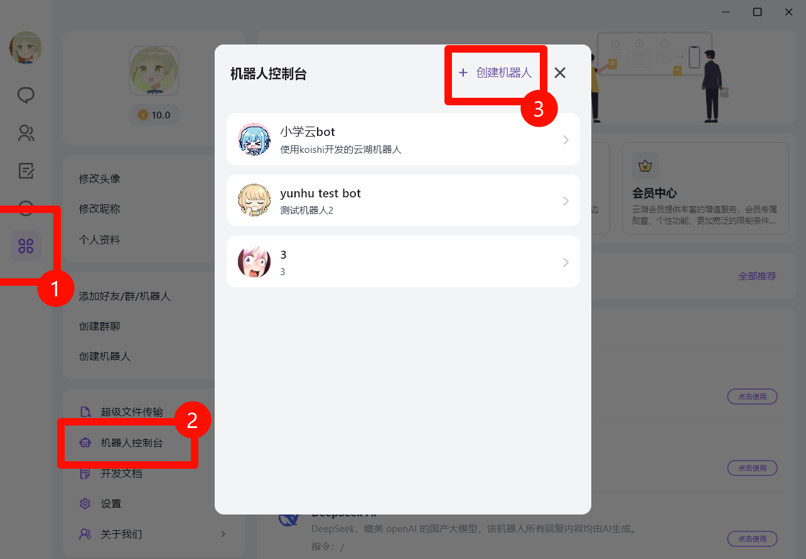
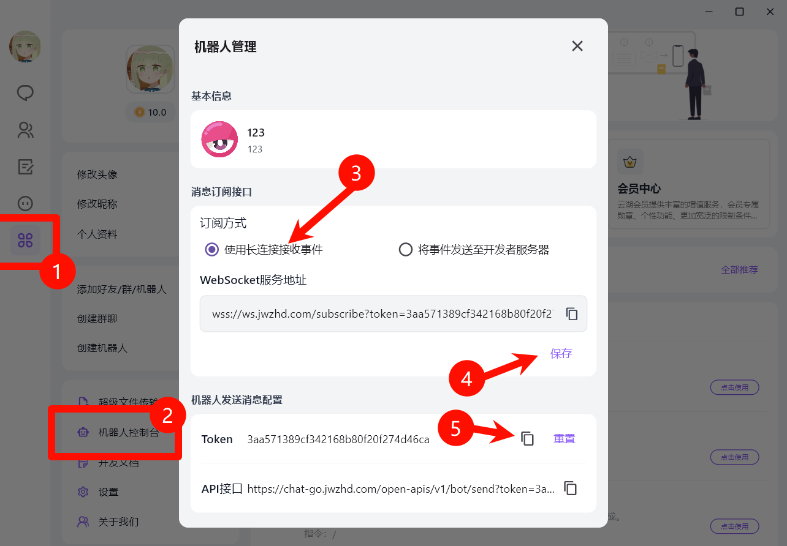
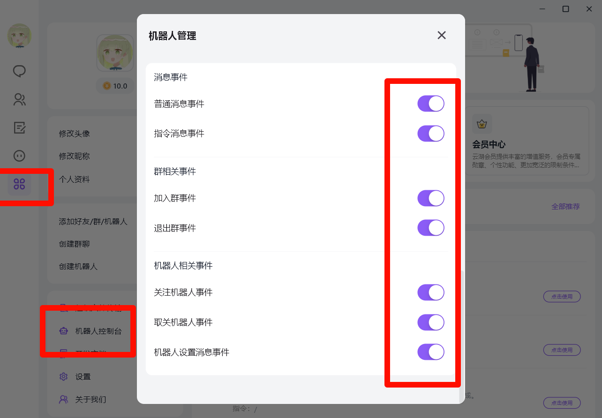

# 首次接入指南

## 首次接入和配置

本指南将引导您完成 `adapter-yunhupro` 在 Koishi 中的首次接入和配置。

## 1. 在云湖平台创建机器人

> **教程以 云湖Windows版客户端 演示**

访问 [云湖官网](https://www.yhchat.com/) ，下载并安装对应的客户端。

注册并登录账号后，进入设置页面，创建一个新的机器人。

根据页面提示，完成机器人的 头像、名称、简介 的配置。

## 2. 获取机器人 Token

打开 **机器人控制台**，复制机器人的 Token：

* **机器人 Token**：这是与云湖 API 通信的密钥。

## 2.1 配置订阅事件

打开 **机器人控制台**，配置机器人接收的事件：

> 可以全部都勾选上

## 3. 连接方式要求

云湖平台支持两种连接方式：

### WebSocket 方式（推荐）

**无需公网 IP**，通过 WebSocket 长连接接收事件推送。

这是默认且推荐的连接方式，配置简单，无需额外的网络配置。

### Webhook 方式

通过 Webhook 接收事件推送，**需要公网访问能力**。

:::tip
如果选择 Webhook 方式，您需要具备**以下条件之一**：

* 拥有一个公网 IPv4 或 IPv6 地址。
* 使用内网穿透服务（如 frp, Ngrok, Cloudflare Tunnel 等）将您的本地 Koishi 服务暴露到公网。

:::

### 连接方式对比

| 特性     | WebSocket | Webhook          |
| -------- | --------- | ---------------- |
| 公网 IP  | ✅ 不需要  | ⚠️ 需要           |
| 配置难度 | ✅ 简单    | ⚠️ 复杂           |
| 多机器人 | ✅ 无限制  | ⚠️ 需要不同路径   |
| 消息混乱 | ✅ 不会    | ⚠️ 路径相同时会   |
| 推荐程度 | ✅ 推荐    | ⚠️ 有特殊需求才用 |

**推荐使用 WebSocket 方式**，除非您有特殊需求必须使用 Webhook。

## 4. 选择接入方式，继续阅读对应教程

完成以上公共前置配置后，根据您的实际部署选择对应的教程继续阅读：

  <a href="./start-webhook" style="flex:1 1 46%;min-width:240px;text-decoration:none;display:flex;flex-direction:column;justify-content:space-between;border:1px solid var(--vp-c-divider);border-radius:12px;padding:16px 20px;transition:border-color .2s,border-style .2s">
    Webhook 方式接入教程
 </a>
  <a href="./start-websocket" style="flex:1 1 46%;min-width:240px;text-decoration:none;display:flex;flex-direction:column;justify-content:space-between;border:1px solid var(--vp-c-divider);border-radius:12px;padding:16px 20px;text-align:right;transition:border-color .2s,border-style .2s">
    WebSocket 方式接入教程（推荐）
  </a>

